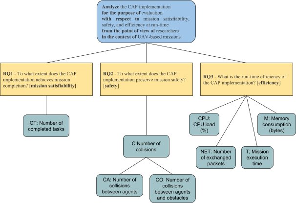

Self-adaptation and safe behaviour management of multiple robots has been widely recognized and studied in research. Even though robots of a mission are autonomous, they dynamically form collaborative groups, called ensembles [2] to gain benefits that otherwise would not be possible. In mobile multi-robot systems new approaches to guarantee sustainable safety are needed to allow (i) multiple entities to
collectively adapt with (ii) negotiation to decide which collective changes are best. This also raises another challenge: which part of the system should be engaged in an adaptation. This is not trivial at all, since solutions for the same problem may be generated at different levels. For instance, an issue of a robot can be resolved in the scope of its mission, by re-calculating its navigation plan, or in the wider scope with the engagement of other robots and supporting systems. The challenge here is to understand these levels and create a mechanism which decides the right scope for an adaptation for a given safety issue. Moreover, having safety-specific mechanisms that are generic and independent from the functional behaviour of the robots is extremely relevant for managing the complexity of
the missions to be performed. In this context, it is fundamental to have a clear separation of concerns while defining the mission (e.g., an operator can focus on the mission functional specification, while a safety engineer can focus on the safetyspecific mechanism), thus making safety-specific mechanisms reusable across missions, projects, and organizations.

We present a collective adaptation process for Mobile Multi-Robot Systems that consists of two segments: first segment that focuses on adaptation triggered by mission problems and another segment that performs adaptation as a result of safety problems in the system. Here, we describe our evalaution of the approach. 

# Publications

- Darko Bozhinoski, Davide Di Ruscio, Ivano Malavolta, Patrizio Pelliccione and Ivica Crnkovic. Safety for Mobile Robotic System: a Systematic Mapping Study from a Software Engineering Perspective. In Journal of Systems and Software (JSS), 2019, Elsevier 
- Darko Bozhinoski, Ivano Malavolta, Antonio Bucchiarone, and AnnaPaola Marconi. Sustainable safety in mobile multi-robot systems via collective adaptation. In Self-Adaptive and Self-Organizing Systems (SASO), 2015 IEEE 9th International Conference, 2015, pp. 172-173, IEEE.
- Darko Bozhinoski. Managing safety and adaptability in Mobile Multi-Robot systems. In Proceedings of the 11th International ACM SIGSOFT Conference on Quality of Software Architectures, 2015, pp. 135-140, ACM.

# Experiment Design

## GOAL

Analyze the Collective Adaptation Process (CAP) implementation for the purpose of evaluation  with respect to mission satisfiability, safety, and run-time efficiency 
from the point of view of researchers in the context of UAV-based missions

## Design
The experiment is designed as a multi-test within object study, because it is conducted on a single object (i.e., the current implementation of CAP) across a set of subjects (i.e., a set of UAV-based missions and a set of robots’ teams).

### Research questions

**RQ1**: To what extent does the CAP implementation achieves mission completion? [mission satisfiability]
_Used metrics_:
- Number of completed tasks

**RQ2**: To what extent does the CAP implementation preserve mission safety? [safety]
_Used metrics_:
- Number of collisions
- Number of collisions between agents
- Number of collisions between agents and obstacles

**RQ3**: What is the run-time efficiency of the CAP implementation? [efficiency]
_Used metrics_:
- memory consumption (bytes)
- CPU utilization (%)
- network traffic (number of packets)
- mission execution time (milliseconds)

## Experimental Results

Coming soon...

# TEAM
1. Darko Bozhinoski
2. Ivano Malavolta
3. Patrizio Pelliccione
4. David Garlan
5. Ivica Crnkovic

